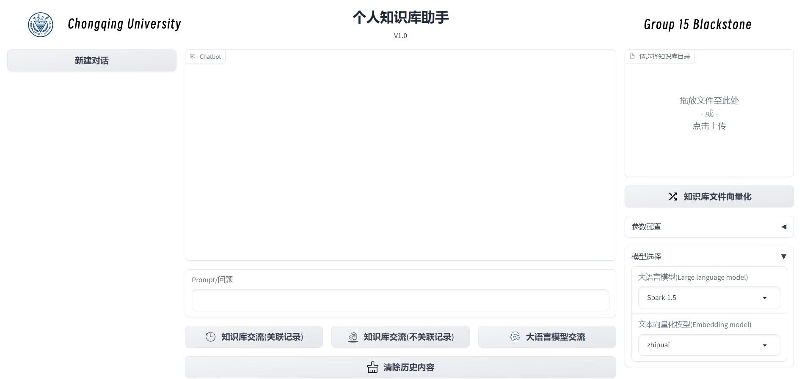
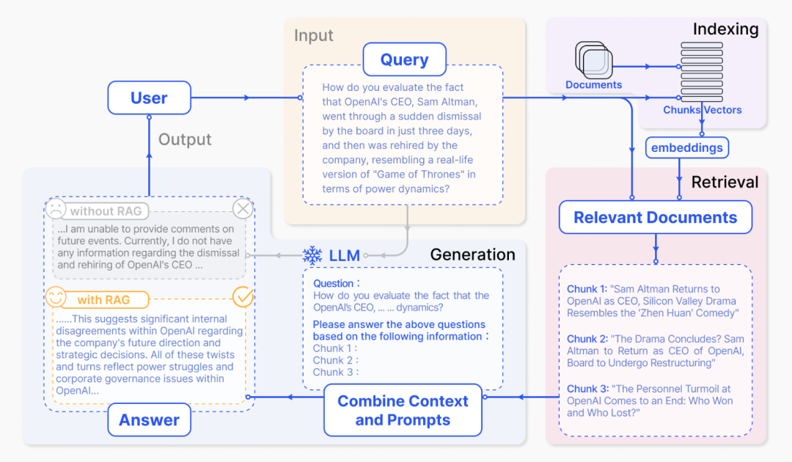

# 个人知识库助手项目

## 一、引言

### 1、项目背景介绍

在当今信息爆炸的时代，人们面临着海量数据的挑战，如何快速、准确地获取所需信息成为了一个迫切的需求。为了解决这一问题，本项目应运而生，它是一个基于大型语言模型应用开发教程的个人知识库助手。该项目通过精心设计和开发，实现了对大量复杂信息的有效管理和检索，为用户提供了一个强大的信息获取工具。

本项目的开发初衷是利用大型语言模型的强大处理能力，结合用户的实际需求，打造一个能够理解自然语言查询并提供精确答案的智能助手。在这一过程中，开发团队对现有的大模型应用进行了深入分析和研究，进而进行了一系列的封装和完善工作，以确保项目的稳定性和易用性。

### 2、目标与意义

本项目的目的是为了提供一个高效、智能的解决方案，帮助用户在面对海量信息时能够快速定位和获取所需知识，从而提高工作效率和决策质量。通过构建一个个人知识库助手，项目旨在简化信息检索过程，使得用户能够通过自然语言查询，轻松访问和整合分散在不同数据源中的信息。

意义方面，该项目具有以下几个关键点：

- **提升信息获取效率**：通过智能检索和问答系统，用户可以迅速找到相关信息，减少了在多个平台或数据库中手动搜索的时间。

- **增强知识管理能力**：项目支持用户构建和维护个人知识库，有助于积累和组织专业知识，形成个人的知识资产。

- **促进决策支持**：通过提供准确、及时的信息，项目能够辅助用户做出更加明智的决策，特别是在需要快速响应的情况下。

- **支持个性化定制**：项目允许用户根据自己的需求和偏好定制知识库，使得信息检索更加个性化和精准。

- **推动技术创新**：项目的开发和应用展示了大型语言模型在信息管理和检索领域的潜力，为未来的技术创新提供了实践案例和灵感。

- **普及智能助手概念**：通过易于使用的界面和部署方式，项目降低了智能助手技术的门槛，使其更加普及和易于接受。

### 3、主要功能

本项目可以实现基于 Datawhale 的现有项目 README 的知识问答，使用户可以快速了解 Datawhale 现有项目情况。

**项目登录界面**


**项目开始界面**


**问答演示界面**


## 二、技术实现

### 1、环境依赖

#### 1.1 技术资源要求

- **CPU**:  Intel 5代处理器（云CPU方面，建议选择 2 核以上的云CPU服务）
  
- **内存（RAM）**: 至少 4 GB

- **操作系统**：Windows、macOS、Linux均可

#### 1.2 项目设置

**克隆储存库**

```shell
git clone -b master https://github.com/doyoulackw/Blackstone.git
```

**创建 Conda 环境并安装依赖项**

- python>=3.9
- pytorch>=2.0.0

```shell
# 创建 Conda 环境
conda create -n llm python==3.9.0
# 激活 Conda 环境
conda activate llm
# 安装依赖项
pip install -r requirements.txt
```


#### 1.3 项目运行

- 启动服务为本地 API
```shell
# Linux 系统
cd project/serve
uvicorn api:app --reload 
```

```shell
# Windows 系统
cd project/serve
python api.py
```
- 运行项目
```shell
cd llm-universe/project/serve
python run_gradio.py -model_name='chatglm_std' -embedding_model='m3e' -db_path='../../data_base/knowledge_db' -persist_path='../../data_base/vector_db'
```
### 2、开发流程简述

#### 2.1 当前的项目版本及未来规划
   - **目前支持的模型**
     - 文心一言
       - [√] ERNIE-Bot
       - [√] ERNIE-Bot-4
       - [√] ERNIE-Bot-turbo
     - 讯飞星火
       - [√] Spark-1.5
       - [√] Spark-2.0
     - 智谱 AI
       - [√] chatglm_pro
       - [√] chatglm_std
       - [√] chatglm_lite

#### 2.2 核心Idea

核心是针对四种大模型 API 实现了底层封装，基于 Langchain 搭建了可切换模型的检索问答链，并实现 API 以及 Gradio 部署的个人轻量大模型应用。

#### 2.3 使用的技术栈

本项目为一个基于大模型的个人知识库助手，基于 LangChain 框架搭建，核心技术包括 LLM API 调用、向量数据库、检索问答链等。项目整体架构如下：


如上，本项目从底向上依次分为 LLM 层、数据层、数据库层、应用层与服务层。

① LLM 层主要基于四种流行 LLM API 进行了 LLM 调用封装，支持用户以统一的入口、方式来访问不同的模型，支持随时进行模型的切换；

② 数据层主要包括个人知识库的源数据以及 Embedding API，源数据经过 Embedding 处理可以被向量数据库使用；

③ 数据库层主要为基于个人知识库源数据搭建的向量数据库，在本项目中我们选择了 Chroma；

④ 应用层为核心功能的最顶层封装，我们基于 LangChain 提供的检索问答链基类进行了进一步封装，从而支持不同模型切换以及便捷实现基于数据库的检索问答；

⑤ 最顶层为服务层，我们分别实现了 Gradio 搭建 Demo 与 FastAPI 组建 API 两种方式来支持本项目的服务访问。

## 三、应用详解

### 1、核心架构

llm-universe 个人知识库助手地址：

https://github.com/doyoulackw/Blackstone/tree/master

该项目是个典型的RAG项目，通过langchain+LLM实现本地知识库问答，建立了全流程可使用开源模型实现的本地知识库对话应用。目前已经支持使用 ***星火spark模型***，***文心大模型***，***智谱GLM*** 等大语言模型的接入。该项目实现原理和一般 RAG 项目一样，如前文和下图所示：

整个 RAG 过程包括如下操作：

1.用户提出问题 Query

2.加载和读取知识库文档  

3.对知识库文档进行分割  

4.对分割后的知识库文本向量化并存入向量库建立索引 

5.对问句 Query 向量化  

6.在知识库文档向量中匹配出与问句 Query 向量最相似的 top k 个

7.匹配出的知识库文本文本作为上下文 Context 和问题⼀起添加到 prompt 中   

8.提交给 LLM 生成回答 Answer

可以大致分为索引，检索和生成三个阶段，这三个阶段将在下面小节配合该 llm-universe 知识库助手项目进行拆解。

### 2、索引-indexing

本节讲述该项目 llm-universe 个人知识库助手：创建知识库并加载文件-读取文件-**文本分割**(Text splitter) ，知识库**文本向量化**(embedding)以及存储到**向量数据库**的实现，

其中**加载文件**：这是读取存储在本地的知识库文件的步骤。**读取文件**：读取加载的文件内容，通常是将其转化为文本格式 。**文本分割(Text splitter)**：按照⼀定的规则(例如段落、句子、词语等)将文本分割。**文本向量化：**这通常涉及到 NLP 的特征抽取，该项目通过zhipuai 开源 api 将分割好的文本转化为数值向量并存储到向量数据库

#### 2.1 知识库搭建-加载和读取

该项目Blackstone个人知识库助手默认知识库包括：

- [《NLP共性AI算法库》PDF版本](https://github.com/doyoulackw/Blackstone/blob/master/knowledge_db/NLP共性AI算法库.pdf)

这些知识库源数据放置在 **./knowledge_db** 目录下，用户也可以自己存放自己其他的文件。

#### 2.2 文本分割和向量化

文本分割和向量化操作，在整个 RAG 流程中是必不可少的。需要将上述载入的知识库分本或进行 token 长度进行分割，或者进行语义模型进行分割。该项目利用 Langchain 中的文本分割器根据 chunk_size (块大小)和 chunk_overlap (块与块之间的重叠大小)进行分割。

- chunk_size 指每个块包含的字符或 Token（如单词、句子等）的数量
- chunk_overlap 指两个块之间共享的字符数量，用于保持上下文的连贯性，避免分割丢失上下文信息

**1.** 可以设置一个最大的 Token 长度，然后根据这个最大的 Token 长度来切分文档。这样切分出来的文档片段是一个一个均匀长度的文档片段。而片段与片段之间的一些重叠的内容，能保证检索的时候能够检索到相关的文档片段。这部分文本分割代码也在 **project/database/create_db.py** 文件，该项目采用了 langchain 中 RecursiveCharacterTextSplitter 文本分割器进行分割。代码如下：

```python
......
def create_db(files=DEFAULT_DB_PATH, persist_directory=DEFAULT_PERSIST_PATH, embeddings="openai"):
    """
    该函数用于加载 PDF 文件，切分文档，生成文档的嵌入向量，创建向量数据库。

    参数:
    file: 存放文件的路径。
    embeddings: 用于生产 Embedding 的模型

    返回:
    vectordb: 创建的数据库。
    """
    if files == None:
        return "can't load empty file"
    if type(files) != list:
        files = [files]
    loaders = []
    [file_loader(file, loaders) for file in files]
    docs = []
    for loader in loaders:
        if loader is not None:
            docs.extend(loader.load())
    # 切分文档
    text_splitter = RecursiveCharacterTextSplitter(
        chunk_size=500, chunk_overlap=150)
    split_docs = text_splitter.split_documents(docs)
    ....
    ....
    ....此处省略了其他代码
    ....
    return vectordb
...........    
```

**2.** 而在切分好知识库文本之后，需要对文本进行 **向量化** 。该项目在 **project/embedding/call_embedding.py** ，文本嵌入方式可调用 zhipuai 的 api 的方式进行文本嵌入。代码如下：

```python
import os
import sys

sys.path.append(os.path.dirname(os.path.dirname(__file__)))
sys.path.append(r"../../")
from embedding.zhipuai_embedding import ZhipuAIEmbeddings
from llm.call_llm import parse_llm_api_key


def get_embedding(embedding: str, embedding_key: str = None, env_file: str = None):
   if embedding_key == None:
      embedding_key = parse_llm_api_key(embedding)
   if embedding == "zhipuai":
      return ZhipuAIEmbeddings(zhipuai_api_key=embedding_key)
   else:
      raise ValueError(f"embedding {embedding} not support ")
```

#### **2.3** 向量数据库

在对知识库文本进行分割和向量化后，就需要定义一个向量数据库用来存放文档片段和对应的向量表示了，在向量数据库中，数据被表示为向量形式，每个向量代表一个数据项。这些向量可以是数字、文本、图像或其他类型的数据。

向量数据库使用高效的索引和查询算法来加速向量数据的存储和检索过程。该项目选择 chromadb 向量数据库（类似的向量数据库还有 faiss 等)。定义向量库对应的代码也在 **project/database/create_db.py** 文件中，persist_directory 即为本地持久化地址，vectordb.persist() 操作可以持久化向量数据库到本地，后续可以再次载入本地已有的向量库。完整的文本分割，获取向量化，并且定义向量数据库代码如下：

```python
def create_db(files=DEFAULT_DB_PATH, persist_directory=DEFAULT_PERSIST_PATH, embeddings="openai"):
    """
    该函数用于加载 PDF 文件，切分文档，生成文档的嵌入向量，创建向量数据库。

    参数:
    file: 存放文件的路径。
    embeddings: 用于生产 Embedding 的模型

    返回:
    vectordb: 创建的数据库。
    """
    if files == None:
        return "can't load empty file"
    if type(files) != list:
        files = [files]
    loaders = []
    [file_loader(file, loaders) for file in files]
    docs = []
    for loader in loaders:
        if loader is not None:
            docs.extend(loader.load())
    # 切分文档
    text_splitter = RecursiveCharacterTextSplitter(
        chunk_size=500, chunk_overlap=150)
    split_docs = text_splitter.split_documents(docs)
    if type(embeddings) == str:
        embeddings = get_embedding(embedding=embeddings)
    # 定义持久化路径
    persist_directory = '../../data_base/vector_db/chroma'
    # 加载数据库
    vectordb = Chroma.from_documents(
    documents=split_docs,
    embedding=embeddings,
    persist_directory=persist_directory  # 允许我们将persist_directory目录保存到磁盘上
    ) 

    vectordb.persist()
    return vectordb
```


### 3、检索-Retriver和**生成**-Generator

本节进入了 RAG 的检索和生成阶段，即对问句 Query 向量化后在知识库文档向量中匹配出与问句 Query 向量最相似的 top k 个片段，匹配出的知识库文本文本作为上下文 Context 和问题⼀起添加到 prompt 中，然后提交给 LLM 生成回答 Answer。下面将根据 llm_universe 个人知识库助手进行讲解。

#### 3.1 向量数据库检索

通过上一章节文本的分割向量化以及构建向量数据库索引，接下去就可以利用向量数据库来进行高效的检索。向量数据库是一种用于有效搜索大规模高维向量空间中相似度的库，能够在大规模数据集中快速找到与给定 query 向量最相似的向量。

#### 3.2 大模型llm的调用

这里以该项目 **project/qa_chain/model_to_llm.py** 代码为例，在 **project/llm/** 的目录文件夹下分别定义了 ***星火spark***，***智谱glm***，***文心llm***等开源模型api调用的封装，并在 **project/qa_chain/model_to_llm.py** 文件中导入了这些模块，可以根据用户传入的模型名字进行调用 llm。代码如下：


```python
def model_to_llm(model:str=None, temperature:float=0.0, appid:str=None, api_key:str=None,Spark_api_secret:str=None,Wenxin_secret_key:str=None):
        """
        星火：model,temperature,appid,api_key,api_secret
        百度问心：model,temperature,api_key,api_secret
        智谱：model,temperature,api_key
        OpenAI：model,temperature,api_key
        """
        if model in ["ERNIE-Bot", "ERNIE-Bot-4", "ERNIE-Bot-turbo"]:
            if api_key == None or Wenxin_secret_key == None:
                api_key, Wenxin_secret_key = parse_llm_api_key("wenxin")
            llm = Wenxin_LLM(model=model, temperature = temperature, api_key=api_key, secret_key=Wenxin_secret_key)
        elif model in ["Spark-1.5", "Spark-2.0"]:
            if api_key == None or appid == None and Spark_api_secret == None:
                api_key, appid, Spark_api_secret = parse_llm_api_key("spark")
            llm = Spark_LLM(model=model, temperature = temperature, appid=appid, api_secret=Spark_api_secret, api_key=api_key)
        elif model in ["chatglm_pro", "chatglm_std", "chatglm_lite"]:
            if api_key == None:
                api_key = parse_llm_api_key("zhipuai")
            llm = ZhipuAILLM(model=model, zhipuai_api_key=api_key, temperature = temperature)
        else:
            raise ValueError(f"model{model} not support!!!")
        return llm
```

#### 3.3 prompt和构建问答链

接下去来到了最后一步，设计完基于知识库问答的 prompt，就可以结合上述检索和大模型调用进行答案的生成。构建 prompt 的格式如下，具体可以根据自己业务需要进行修改：


```python
from langchain.prompts import PromptTemplate

# template = """基于以下已知信息，简洁和专业的来回答用户的问题。
#             如果无法从中得到答案，请说 "根据已知信息无法回答该问题" 或 "没有提供足够的相关信息"，不允许在答案中添加编造成分。
#             答案请使用中文。
#             总是在回答的最后说“谢谢你的提问！”。
# 已知信息：{context}
# 问题: {question}"""
template = """使用以下上下文来回答最后的问题。如果你不知道答案，就说你不知道，不要试图编造答
案。最多使用三句话。尽量使答案简明扼要。总是在回答的最后说“谢谢你的提问！”。
{context}
问题: {question}
有用的回答:"""

QA_CHAIN_PROMPT = PromptTemplate(input_variables=["context","question"],
                                 template=template)

# 运行 chain
```

并且构建问答链：创建检索 QA 链的方法 RetrievalQA.from_chain_type() 有如下参数：

- llm：指定使用的 LLM
- 指定 chain type : RetrievalQA.from_chain_type(chain_type="map_reduce")，也可以利用load_qa_chain()方法指定chain type。
- 自定义 prompt ：通过在RetrievalQA.from_chain_type()方法中，指定chain_type_kwargs参数，而该参数：chain_type_kwargs = {"prompt": PROMPT}
- 返回源文档：通过RetrievalQA.from_chain_type()方法中指定：return_source_documents=True参数；也可以使用RetrievalQAWithSourceChain()方法，返回源文档的引用（坐标或者叫主键、索引）

```python

# 自定义 QA 链
self.qa_chain = RetrievalQA.from_chain_type(llm=self.llm,
                                        retriever=self.retriever,
                                        return_source_documents=True,
                                        chain_type_kwargs={"prompt":self.QA_CHAIN_PROMPT})
```

问答链效果如下：基于召回结果和 query 结合起来构建的 prompt 效果


上述详细不带记忆的检索问答链代码都在该项目：**project/qa_chain/QA_chain_self.py** 中，此外该项目还实现了带记忆的检索问答链，两种自定义检索问答链内部实现细节类似，只是调用了不同的 LangChain 链。完整带记忆的检索问答链条代码 **project/qa_chain/Chat_QA_chain_self.py** 如下：

```python
from langchain.prompts import PromptTemplate
from langchain.chains import RetrievalQA
from langchain.vectorstores import Chroma
from langchain.chains import ConversationalRetrievalChain
from langchain.memory import ConversationBufferMemory
from langchain.chat_models import ChatOpenAI

from qa_chain.model_to_llm import model_to_llm
from qa_chain.get_vectordb import get_vectordb


class Chat_QA_chain_self:
    """"
    带历史记录的问答链  
    - model：调用的模型名称
    - temperature：温度系数，控制生成的随机性
    - top_k：返回检索的前k个相似文档
    - chat_history：历史记录，输入一个列表，默认是一个空列表
    - history_len：控制保留的最近 history_len 次对话
    - file_path：建库文件所在路径
    - persist_path：向量数据库持久化路径
    - appid：星火
    - api_key：星火、百度文心、OpenAI、智谱都需要传递的参数
    - Spark_api_secret：星火秘钥
    - Wenxin_secret_key：文心秘钥
    - embeddings：使用的embedding模型
    - embedding_key：使用的embedding模型的秘钥（智谱或者OpenAI）  
    """
    def __init__(self,model:str, temperature:float=0.0, top_k:int=4, chat_history:list=[], file_path:str=None, persist_path:str=None, appid:str=None, api_key:str=None, Spark_api_secret:str=None,Wenxin_secret_key:str=None, embedding = "openai",embedding_key:str=None):
        self.model = model
        self.temperature = temperature
        self.top_k = top_k
        self.chat_history = chat_history
        #self.history_len = history_len
        self.file_path = file_path
        self.persist_path = persist_path
        self.appid = appid
        self.api_key = api_key
        self.Spark_api_secret = Spark_api_secret
        self.Wenxin_secret_key = Wenxin_secret_key
        self.embedding = embedding
        self.embedding_key = embedding_key


        self.vectordb = get_vectordb(self.file_path, self.persist_path, self.embedding,self.embedding_key)
        
    
    def clear_history(self):
        "清空历史记录"
        return self.chat_history.clear()

    
    def change_history_length(self,history_len:int=1):
        """
        保存指定对话轮次的历史记录
        输入参数：
        - history_len ：控制保留的最近 history_len 次对话
        - chat_history：当前的历史对话记录
        输出：返回最近 history_len 次对话
        """
        n = len(self.chat_history)
        return self.chat_history[n-history_len:]

 
    def answer(self, question:str=None,temperature = None, top_k = 4):
        """"
        核心方法，调用问答链
        arguments: 
        - question：用户提问
        """
        
        if len(question) == 0:
            return "", self.chat_history
        
        if len(question) == 0:
            return ""
        
        if temperature == None:
            temperature = self.temperature

        llm = model_to_llm(self.model, temperature, self.appid, self.api_key, self.Spark_api_secret,self.Wenxin_secret_key)

        #self.memory = ConversationBufferMemory(memory_key="chat_history", return_messages=True)

        retriever = self.vectordb.as_retriever(search_type="similarity",   
                                        search_kwargs={'k': top_k})  #默认similarity，k=4

        qa = ConversationalRetrievalChain.from_llm(
            llm = llm,
            retriever = retriever
        )

        #print(self.llm)
        result = qa({"question": question,"chat_history": self.chat_history})       #result里有question、chat_history、answer
        answer =  result['answer']
        self.chat_history.append((question,answer)) #更新历史记录

        return self.chat_history  #返回本次回答和更新后的历史记录
```

# 3.总结与展望

## 3.1 个人知识库关键点总结
该实例是一个基于大型语言模型（LLM）的个人知识库助手项目，通过智能检索和问答系统，帮助用户快速定位和获取与知识库相关的知识。以下是该项目的关键点：

**关键点一**

1. 项目使用多种方法完成对文件的抽取与概括，生成对应的知识库。在完成对文件抽取与概括的同时，还是用相应的方法完成文本中网页链接和可能引起大模型风控词汇的过滤；

2. 项目利用Langchain中的文本切割器完成知识库向量化操作前的文本分割，向量数据库使用高效的索引和查询算法来加速向量数据的存储和检索过程，快速的完成个人知识库数据建立与使用。


**关键点二**

项目对不同的API进行了底层封装，用户可以避免复杂的封装细节，直接调用相应的大语言模型即可。
